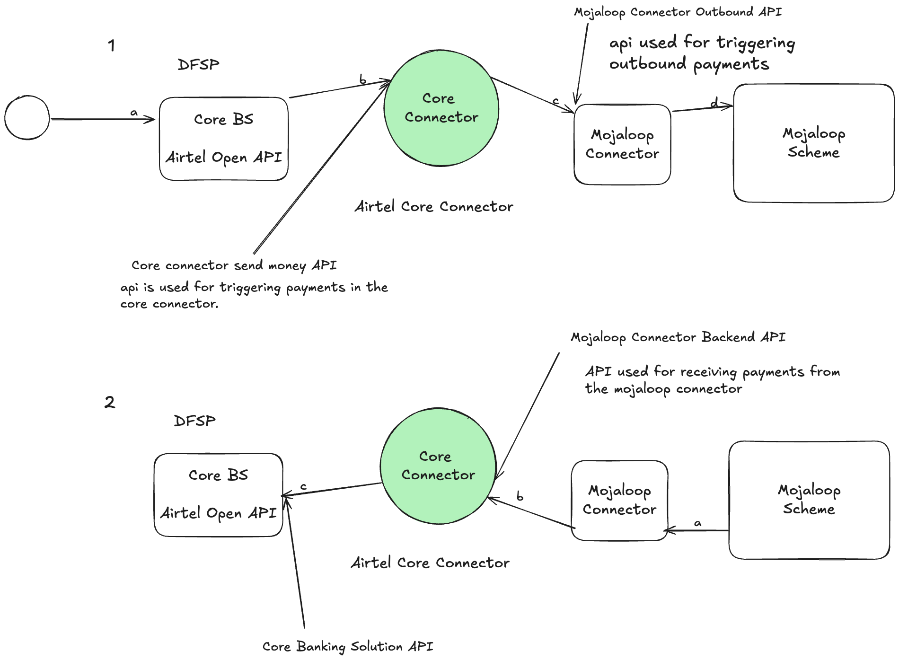

# Core Connector Template
This is a template that can be adapted as a starting point to develop DFSP
core connectors for Mojaloop Payment Manager For Mojaloop

> For full forms check the glossary section

# Introduction
A core connector is a middleware that facilitates a connection between the DFSP and the mojaloop connector.



# Prerequisites
Before you start building a core connector, there are some requirements that need to be in place before implementation starts. These are important because they affect the success of the integration

- CBS Sandbox API
- Access credentials 
- Typescript knowledge
- Beginner docker knowledge 
- Git knowledge
- Mojaloop Knowledge
- For Windows users you will need WSL (Ubuntu)

If you need to get knowledge on how Mojaloop works, consider taking the [Mojaloop Training Program](https://mojaloop.io/mojaloop-training-program/).

# Code structure and Architecture

Below is an output of the directory structure of the core connector template.

To use this template, you will need to understand it's structure, the changing components and the static components which you should not worry about.

```bash
.
├── Dockerfile
├── LICENSE
├── README.md
├── commitlint.config.js
├── docker-compose.yml
├── docs
│   └── Overview.png
├── jest.config.js
├── package-lock.json
├── package.json
├── src
│   ├── api-spec
│   ├── config.ts
│   ├── constants.ts
│   ├── core-connector-svc
│   ├── domain
│   ├── index.ts
│   ├── infra
│   └── plugins
├── test
│   ├── fixtures.ts
│   ├── func
│   ├── mocks
│   ├── setup.ts
│   └── unit
└── tsconfig.json

12 directories, 15 files
```
# Components 
The template contains the

# Configuration.
All configuration for any core connector should be put in environment variables.

Environment variables are configured through the .env.example file in the root of this folder.

Before using the .env.example file, you should create a .env file from it so that it can be used by the executing core connector.

Convict is the tool that is used in this repository for configuration management.

# Glossary
- DFSP : Digital Financial Service Provider
- CBS: Core Banking Solution
- API: Application Programming Interface
- WSL: Windows Sub-System For Linux