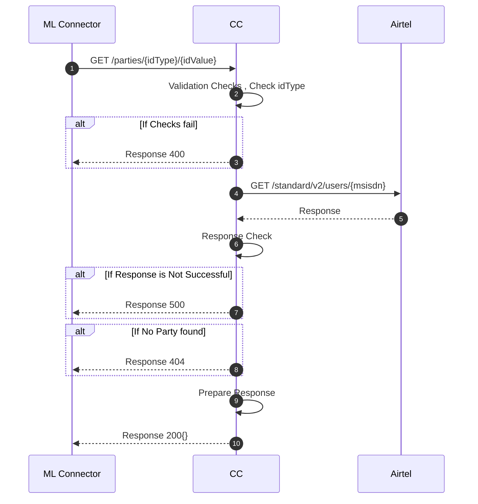

# Payee Get Parties for Airtel 

```mermaid
sequenceDiagram
  autonumber
  ML Connector->>CC: GET /parties/{idType}/{idValue}
  CC->>CC:Validation Checks , Check idType
  Alt If Checks fail
  CC-->>ML Connector: Response 400
  End
  CC->>Airtel:GET /standard/v2/users/{msisdn}
  Airtel-->>CC: Response
  CC->>CC:Response Check
  Alt If Response is Not Successful
  CC-->>ML Connector: Response 500
  End
  Alt If No Party found
  CC-->>ML Connector: Response 404
  End
  CC->>CC: Prepare Response
  CC-->>ML Connector: Response 200{}
```
