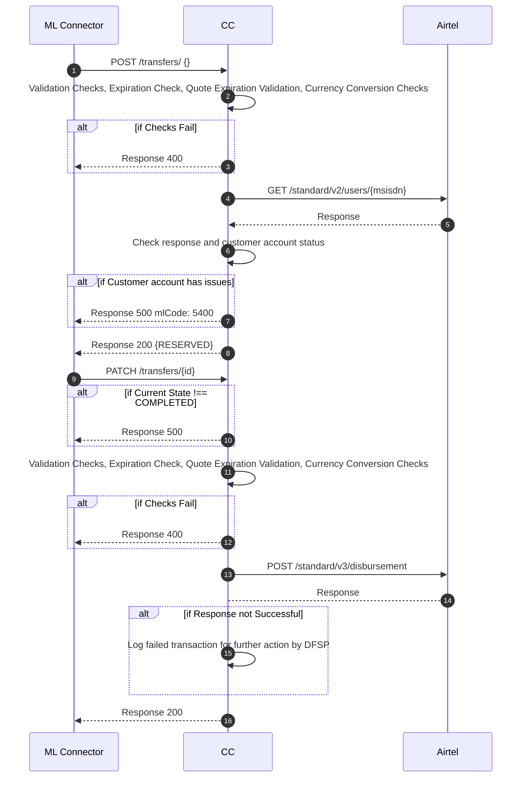

# Payee Transfers for this DFSP
This sequence diagram shows the series of steps the core connector takes to handle a POST `/transfers` request from the mojaloop connector.

```mermaid
sequenceDiagram
  autoNumber
ML Connector ->> CC:  POST /transfers/ {}
CC->>CC:Validation Checks, Expiration Check, Quote Expiration Validation, Currency Conversion Checks
Alt if Checks Fail
CC-->>ML Connector: Response 400
End
CC->>Airtel: GET /standard/v2/users/{msisdn}
Airtel-->>CC: Response 
CC->>CC: Check response and customer account status 
Alt if Customer account has issues 
CC-->> ML Connector: Response 500 mlCode: 5400
End
CC-->>ML Connector: Response 200 {RESERVED}
ML Connector->>CC: PATCH /transfers/{id}
Alt if Current State !== COMPLETED
CC-->>ML Connector: Response 500
End
CC->>CC: Validation Checks, Expiration Check, Quote Expiration Validation, Currency Conversion Checks
Alt if Checks Fail
CC-->>ML Connector: Response 400
End
CC->>Airtel: POST /standard/v3/disbursement
Airtel-->CC: Response
Alt if Response not Successful
CC->>CC: Log failed transaction for further action by DFSP
End
CC-->>ML Connector: Response 200

```
