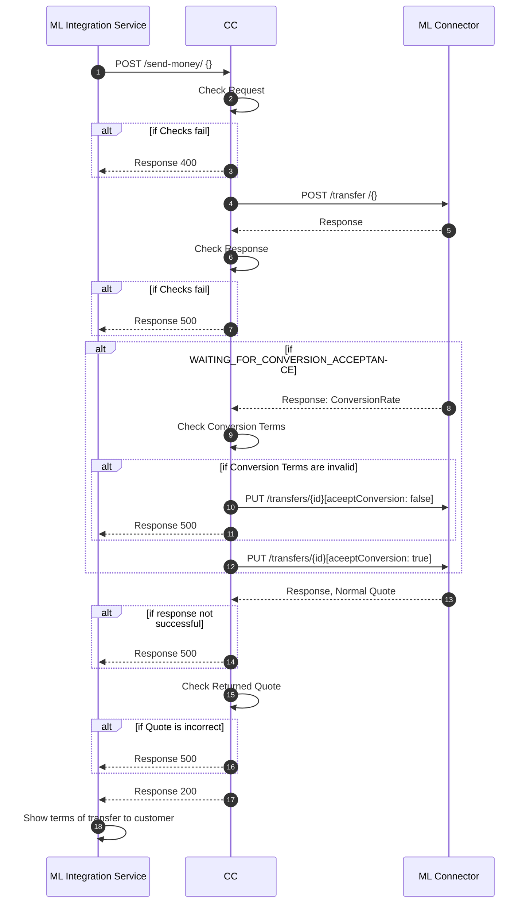

```mermaid
sequenceDiagram
  autoNumber
  ML Integration Service->>CC: POST /send-money/ {}
  CC->>CC: Check Request
  Alt if Checks fail
  CC-->>ML Integration Service: Response 400
  End
  CC->>ML Connector: POST /transfer /{}
  ML Connector-->>CC: Response
  CC->> CC: Check Response
  Alt if Checks fail
  CC-->>ML Integration Service: Response 500
  End

  Alt if WAITING_FOR_CONVERSION_ACCEPTANCE
  ML Connector-->>CC: Response: ConversionRate
  CC->>CC: Check Conversion Terms
  Alt if Conversion Terms are invalid
  CC->>ML Connector: PUT /transfers/{id}[aceeptConversion: false]
  CC-->>ML Integration Service: Response 500
  End
  CC->>ML Connector: PUT /transfers/{id}[aceeptConversion: true]
  End
  ML Connector-->>CC:Response, Normal Quote
  Alt if response not successful
  CC-->>ML Integration Service: Response 500
  End
  CC->>CC: Check Returned Quote
  Alt if Quote is incorrect
  CC-->>ML Integration Service: Response 500
  End
  CC-->>ML Integration Service: Response 200
  ML Integration Service->>ML Integration Service:Show terms of transfer to customer
```
