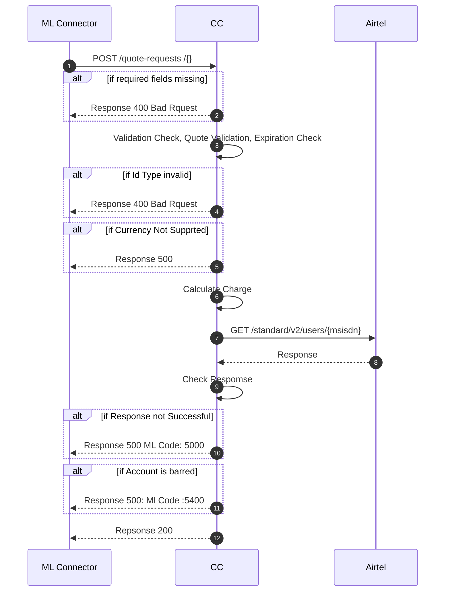

```mermaid
   sequenceDiagram
autoNumber
ML Connector ->> CC: POST /quote-requests /{}
Alt if required fields missing
CC-->>ML Connector: Response 400 Bad Rquest
End
CC->> CC:Validation Check, Quote Validation, Expiration Check
Alt if Id Type invalid
CC-->>ML Connector: Response 400 Bad Rquest
End
Alt if Currency Not Supprted
CC-->>ML Connector: Response 500
End
CC->>CC:Calculate Charge
CC->> Airtel:GET /standard/v2/users/{msisdn}
Airtel -->> CC:Response
CC->>CC: Check Respomse
Alt if Response not Successful
CC-->>ML Connector: Response 500 ML Code: 5000
End
Alt if Account is barred
CC-->>ML Connector:Response 500: Ml Code :5400
End
CC-->>ML Connector: Repsonse 200
```
