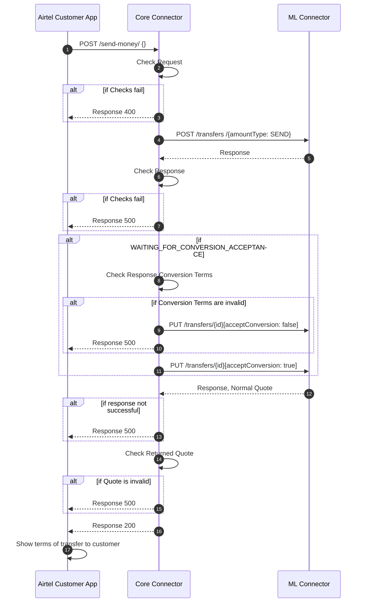

# Send Money Integration Approaches 

Airtel Money DRPP integration patterns.

Table of Contents
- [Introduction](#introduction)
    - [Initial Step](#initial-step)
- [Approach 1](#approach-1)
- [Approach 2](#approach-2)

# Introduction
The send-money integration patterns are the approaches the integration team has designed to be able to support customers of Airtel in sending outbound payments.

# Initial Step
The send-money customer journey begins when the customer expresses interest to send funds by specifying details about the payee and amount to send. This initiation step applies to both approaches going to be presented in this documentation

Here is a sequence diagram that describes the process. 

In this sequence diagram the Airtel Customer Facing application (USSD or Mobile App) receives some data from the customer about the payment details and then sends the data to a Core Connector middleware that is designed to retrieve information about the payee and how much it will cost to execute the transfer

## Approach 1