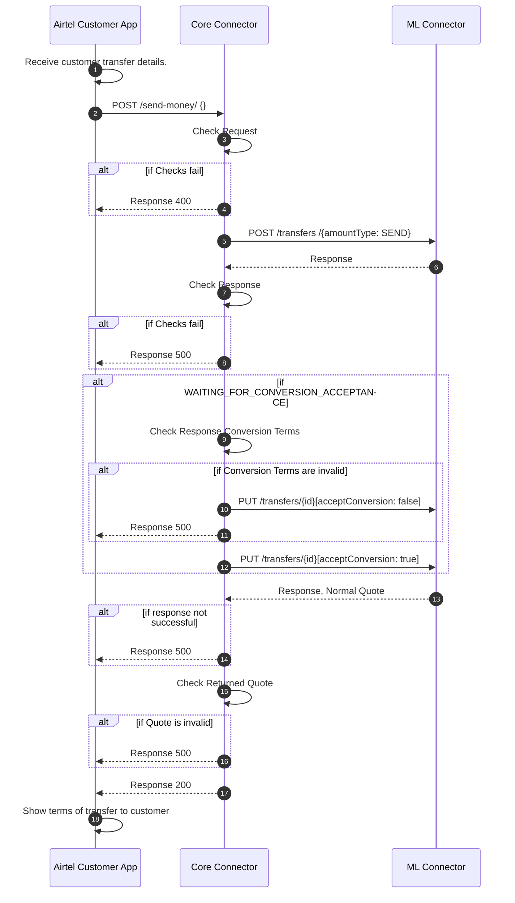
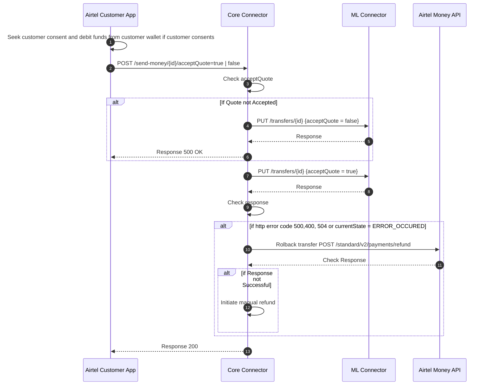
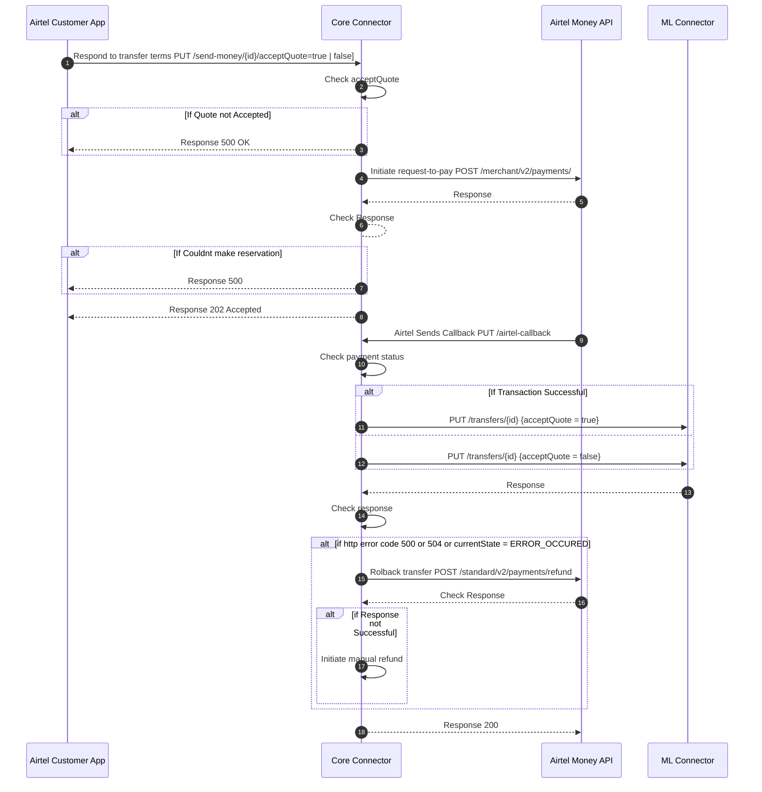

# Send Money Integration Approaches 

Airtel Money DRPP Send Money integrations.

# Table of Contents
- [Introduction](#introduction)
-  [API Documentation](#send-money-api-documentation)
  - [Payment Manager](#payment-manager)
- [Customer Journey](#)
- [Initial Step](#initial-step)
- [Confirm Send Money Approaches](#confirm-send-money-approaches)
    - [Airtel Handling Debit of Funds](#airtel-handling-debit-of-funds)
    - [Core Connector Initiating Debit of Funds ](#core-connector-initiating-debit-of-funds)

# Introduction
The send-money integration patterns are the approaches the integration team has designed to be able to support customers of Airtel in sending outbound payments. The approaches presented in this documentation present 2 scenarios where either the Airtel Customer App or the Core Connector Middleware handles the function of deduction of funds from the customer's account.  There are sequence diagrams and descriptions in the [approaches](#approaches) section.

# Send Money API Documentation
The Send money api is used by the Airtel Customer App to trigger outgoing payments from a customer account. There are two outbound payment use cases that the COMESA Digital Retail Payments Platform is looking to support i.e
- P2P Send Money
- P2B Merchant Payments

## Payment Manager 
Payment manager is a software built to manage the flow of api requests between the DFSP in question and the mojaloop hub. A connection middleware called a core connector is at the heart of this integration. The core connector runs as part of the services of Payment Manager. Requests flow between Payment Manager services and the core connection middleware to broker incoming and outgoing payments.

Every Digital Financial Service Provider (DFSP) that will participate in the DRPP will have to host their instance of Payment Manager whether on premise or in the cloud when the platform goes live. Payment Manager contains a connection manager which brokers a secure connection between the DFSP and the Mojaloop Switch.

The api that the Customer Application interacts with is called the Core Connector Send Money Api. It supports the 2 use cases P2P and P2B. 

Please find it at this link. [API Documentation](http://bit.ly/3D6wW6N)

# Customer Journey
There are 2 use cases the DRPP intends to support and offer to customers. P2P and P2B. Here is a generic customer journey. 
1. Customer Opens application or dials USSD code.
2. Customer enters payee identifier
3. Customer enters amount to send 
4. Customer initiates the transfer by submitting the data
5. Application responds with transfer terms and name of the payee.
6. Customer reviews payment terms and payee details
7. Customer proceeds to abort or approve the transfer
8. If customer approves, the funds are deducted from their account.

Step `4` represents the [initial step](#initial-step) of triggering the payment and step `7` represents the [Confirm Send Money Step](#confirm-send-money-approaches)
The approaches provided in the [Confirm Send Money Approaches](#confirm-send-money-approaches) section address options for handling events from step `7` onwards.

# Initial Step
The send-money customer journey begins when the customer expresses interest to send funds by specifying details about the payee and amount to send. This initiation step applies to both approaches going to be presented in this documentation. 

Here is a sequence diagram that describes the process. 

In this sequence diagram the Airtel Customer Facing application (USSD or Mobile App) receives some data from the customer about the payment details and then sends the data to a Core Connector middleware that is designed to retrieve information about the payee and how much it will cost to execute the transfer. 

This step corresponds to the following requests in the [api documentation](http://bit.ly/3D6wW6N).
- POST /send-money
- POST /merchant-payment

# Confirm Send Money Approaches
In reference to the [customer journey](#customer-journey), this section presents 2 ways of handling the series of events from step `7`. This is the point where 
if the customer has approved of the payment, either airtel or the core connector middleware will take the responsibility of debiting
funds from the customer account. These are the approaches shared here.

## Airtel Handling Debit of Funds
In this approach, after the customer has reviewed the transfer terms, the name of the payee and has approved the transfer. Airtel Customer Application handles 
the debiting of funds from the customer account.

Here is a sequence diagram to show the steps from an airtel and core connector perspective.

This step corresponds to the following requests in the [api documentation](http://bit.ly/3D6wW6N)
- PUT /send-money/{transferId}
- PUT /merchant-payment/{transferId}

## Core Connector Initiating Debit of Funds 
In this approach, after the customer has reviewed the transfer terms, the name of the payee and has approved the transfer. The Core Connector Middleware initiates debit of funds from the customer account.

Here is a sequence diagram to show the steps from an airtel and core connector perspective.

This step corresponds to the following requests in the [api documentation](http://bit.ly/3D6wW6N)
- PUT /send-money/{transferId}
- PUT /merchant-payment/{transferId}
- PUT /callback (This is a callback URL registered in Airtel Open API Portal)

