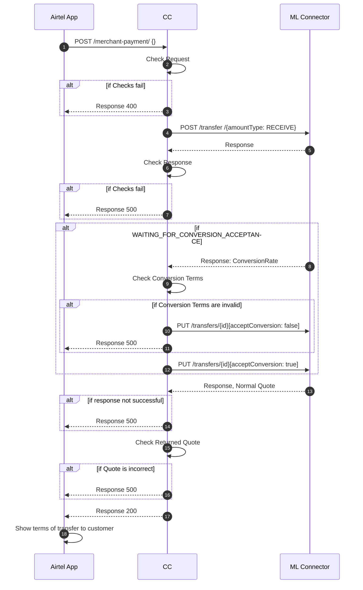

# Payer Initiate Merchant Payment 
This sequence diagram details the process of initiating a merchant payment and the steps the core connector takes to initiate a payment in the mojaloop connector.

