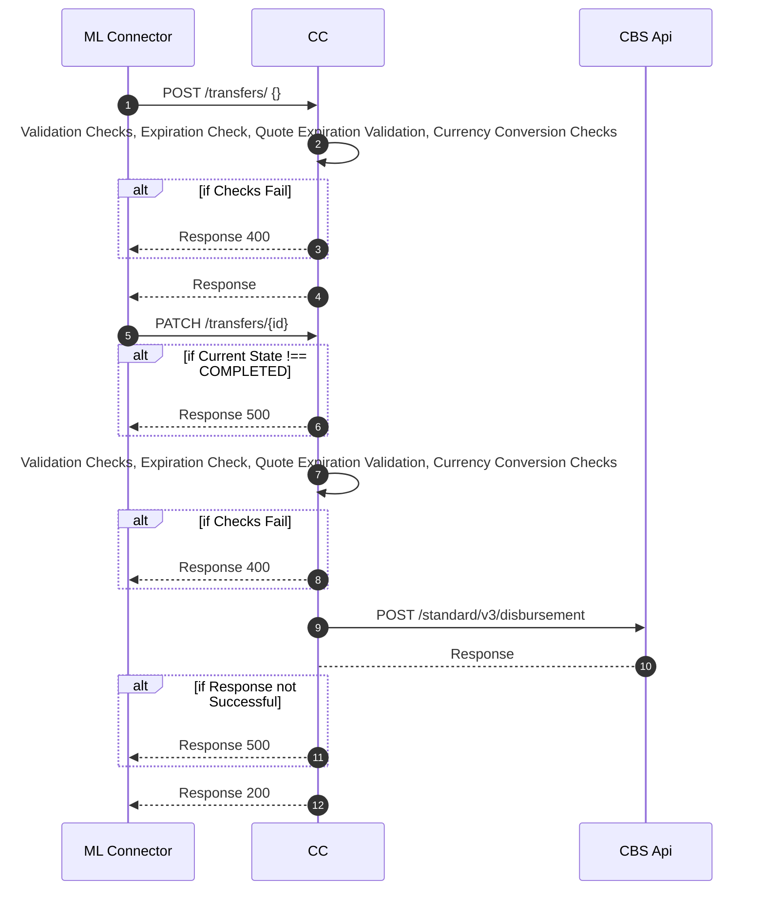

# Payee Transfers for this DFSP

```mermaid
sequenceDiagram
  autoNumber
ML Connector ->> CC:  POST /transfers/ {}
CC->>CC:Validation Checks, Expiration Check, Quote Expiration Validation, Currency Conversion Checks
Alt if Checks Fail
CC-->>ML Connector: Response 400
End
CC-->>ML Connector: Response
ML Connector->>CC: PATCH /transfers/{id}
Alt if Current State !== COMPLETED
CC-->>ML Connector: Response 500
End
CC->>CC: Validation Checks, Expiration Check, Quote Expiration Validation, Currency Conversion Checks
Alt if Checks Fail
CC-->>ML Connector: Response 400
End
CC->>CBS Api: POST /standard/v3/disbursement
CBS Api-->CC: Response
Alt if Response not Successful
CC-->>ML Connector: Response 500
End
CC-->>ML Connector: Response 200

```
