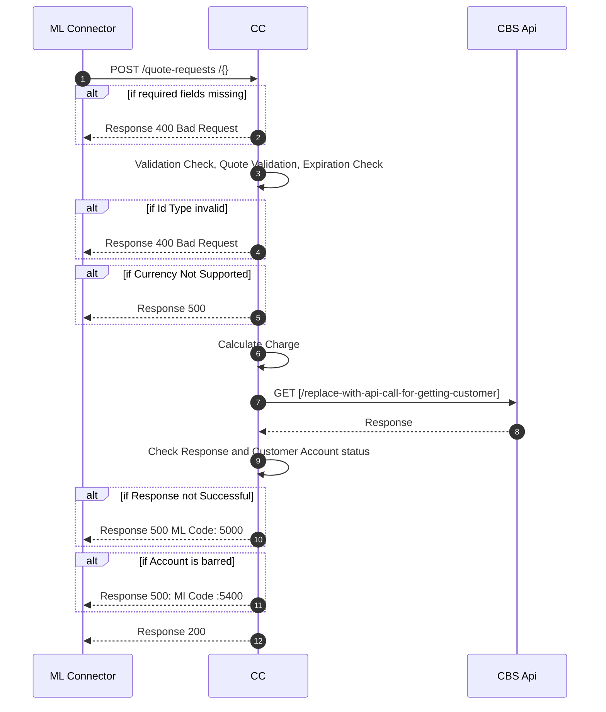

# Payee Quote requests for this DFSP
This sequence diagram shows the set of steps that the core connector goes through to handle a request for a quote from the mojaloop connector.

```mermaid
   sequenceDiagram
autoNumber
ML Connector ->> CC: POST /quote-requests /{}
Alt if required fields missing
CC-->>ML Connector: Response 400 Bad Request
End
CC->> CC:Validation Check, Quote Validation, Expiration Check
Alt if Id Type invalid
CC-->>ML Connector: Response 400 Bad Request
End
Alt if Currency Not Supported
CC-->>ML Connector: Response 500
End
CC->>CC:Calculate Charge
CC->> CBS Api:GET [/replace-with-api-call-for-getting-customer] 
CBS Api -->> CC:Response
CC->>CC: Check Response and Customer Account status 
Alt if Response not Successful
CC-->>ML Connector: Response 500 ML Code: 5000
End
Alt if Account is barred
CC-->>ML Connector:Response 500: Ml Code :5400
End
CC-->>ML Connector: Response 200
```
