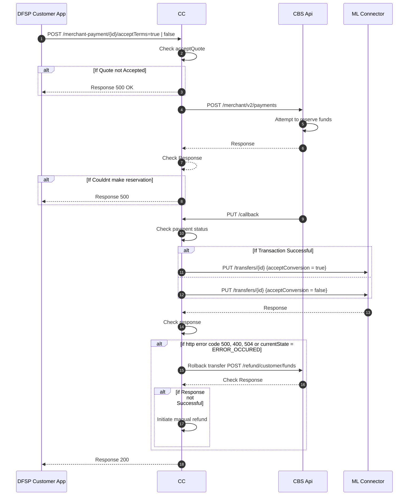

# Payer Update Merchant Payment 
This sequence diagram details the process of updating an initiated merchant payment and the steps the core connector takes to initiate a payment in the mojaloop connector.

