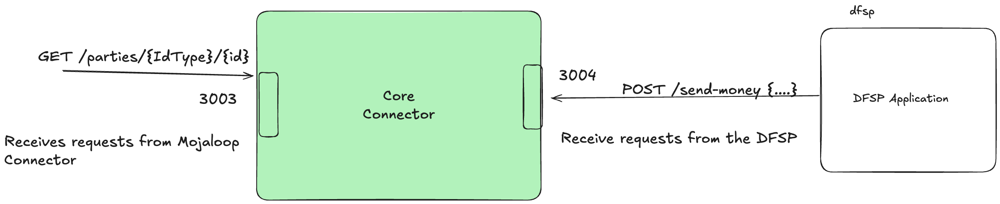

# Networking 
The core connector template is setup to expose two servers on two seperate ports.

One server is supposed to handle requests from the DFSP and the other port is supposed handle and receive requests from the Mojaloop Connector.

The port allocation is as follows

- 3004 DSFP Server
- 3003 Mojaloop Connector Server.

Requests should be directed respectively. When configuring the a payment manager deployment, let the URL for the core connector point to the Mojaloop Connector server port. Such that the requests from the mojaloop connector are handled accordingly.
