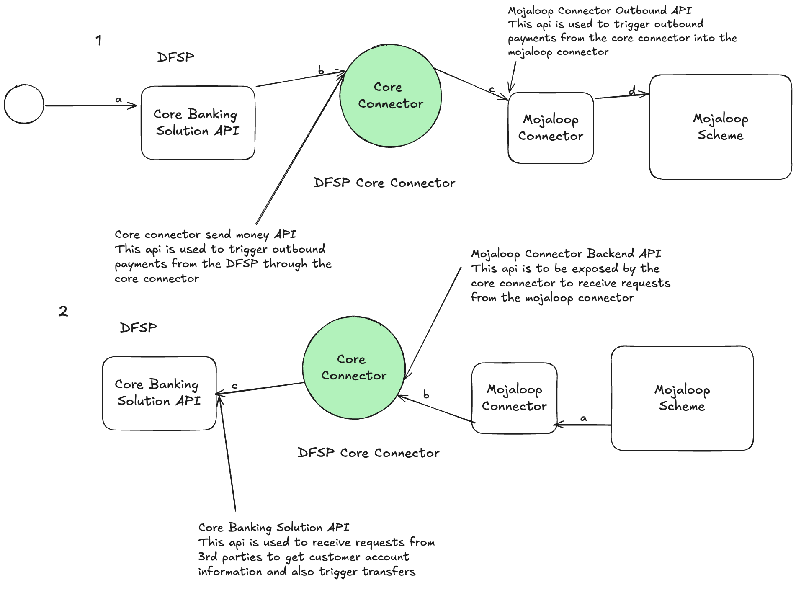
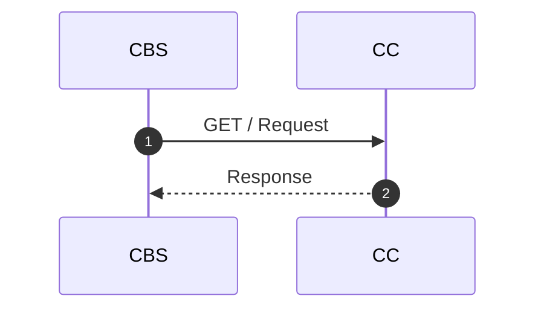

# Core Connector Template
Core Connector template to be adapted for rapid core connector development.

> For full forms check the glossary section

# Table of Contents
1. [Introduction](./README.md#introduction)
2. [API Service](./Service.md) 
3. [Route Handling and Api Specifications](./RoutingAndApiSpecifications.md)
4. [Networking](./Networking.md)
5. [Core Banking Solution Client](./CBSClient.md)
6. [Mojaloop Connector Client](./SDKClient.md)
7. [Configuration Management](./Configuration.md)
8. [Aggregate for Business Logic](./CoreConnectorAggregate.md)
9. [Error Handling](./ErrorHandling.md)
10. [Integration Accounts](./IntegrationAccounts.md)
11. [Request Lifecycle](./RequestHandling.md)
12. [Glossary](#glossary)

# Introduction
A core connector is a middleware that facilitates a connection between the DFSP and the mojaloop connector.



# Prerequisites
Before you start building a core connector, there are some requirements that need to be in place before implementation starts. These are important because they affect the success of the integration

- CBS Sandbox API
- Access credentials 
- Typescript knowledge
- Beginner docker knowledge 
- Git knowledge
- Mojaloop Knowledge
- For Windows users you will need WSL (Ubuntu)

If you need to get knowledge on how Mojaloop works, consider taking the [Mojaloop Training Program](https://mojaloop.io/mojaloop-training-program/).

# Getting started with DFSP Integration
Important information has to be acquired and how they are acquired may vary with DFSP to DFSP. They might differ interms of parameter in the headers and also there request and response bodies. All in all the implementation is very similar. What needs to be acquired is:

### Payee
- A way of retreiving a customers KYC information.(Get Parties)
- A way of acquiring how much it will cost someone to recieve funds in their DFSP.(Quote Requests)
- A way of depositing funds into their account.(Transfers)

### Payer
- A way of initiating a payment from the DFSP to the CC either on USSD or on their web or mobile application.
- A way of sending or removing funds from a a payers account.
- A way of checking the state of transaction
- A way of refunding a customers account

Before getting started with implementation with actual code, a sequence diagrams must be drawn and must be put in docs folder in the CC. These are crucial as they help with logic and are to be shown to stakeholder like project managers and the scrum master as it gives a high lever overview of what functionality is being implemented at that moment in time. A powerful tool which is to be used is mermaid. [Mermaid Documentation](https://mermaid.js.org/syntax/sequenceDiagram.html)


# IMPORTANT NOTE:
Important Configuration Information

To make requests to the DFSP, certain sensitive information such as authentication keys and parameters in headers are required. These credentials should be stored in a secure environment file (.env) located in the root folder of the project.

Please note that this information is confidential and should not be shared with anyone outside of the project team. It is crucial to keep these credentials private to prevent unauthorized access.

Do not expose sensitive information in plain code that will be pushed to the public repository. Instead, use environment variables or secure storage mechanisms to protect these credentials.

# Naming Conventions used in the CC

- types are prefixed with a <strong>T</strong> i.e
```typescript
export type TCBSConfig 
```
- interfaces are prefixed with an <strong>I</strong> i.e
```typescript
export interface ICbsClient
```
- The DFSP name is prefixed as the client class file and name, i.e if the name of the DFSP is <strong>ABCD</strong>, then the client should be
```typescript
class ABCDClient
```

# Implementation

<strong><em> First Step: </em></strong>Setting up the  [Configurations](Configuration.md) . These are important configurations which need to set up at initial stage.


<strong><em> Second Step: </em></strong>Setting up the [CBSClient](CBSClient.md). These is the class that has ICBSClient methods being implemented. 


<strong><em> Third Step: </em></strong>Getting familiar with the dfspCoreConnectorRoutes and sdkCoreConnectorRoutes in the [Core-Connector-svc](../core-connector-template/src/core-connector-svc/) folder. The routes are were incoming requests are handled and directed to specific parts of an application. The two important routes are the [DFSPCoreConnectorRoutes](DfspCoreConnectorRoutes.md) and the [SDKCoreConnectorRoutes](SdkCoreConnectorRoutes.md).


# Payee Integration.

This section describes how to implement payee integrations to support payee operations from the Mojaloop Connector

# How to implement Get Parties

Important information needs to be acquired from the DFSP. An endpoint to retieve a payee's infromation. The api must have an id type that can be used to retieve a KYC information either through a GET/{id} or a POST which has a the id in the request body. 

for example:
- GET request in curl
```curl
curl -X GET \
  'https://example.com/api/kyc/12345' \
  -H 'Authorization: Bearer YOUR_API_KEY'

```
- POST request in curl
```curl
curl -X GET \
  'https://example.com/api/kyc' \
  -H 'Authorization: Bearer YOUR_API_KEY' \
  -G \
  --data-urlencode 'customer_id=12345' \
  --data-urlencode 'id_type=PASSPORT' \
  --data-urlencode 'id_number=AB123456'
```


# How to implement Quote Requests
TBD...

# How to implenent Transfers
TBD...

# Payer Integration
This section describes how to implement payer integrations to support payer operations to the Mojaloop Connector

# How to implement Send Money
TBD...

# How to implement Update Send Money
TBD...

# Glossary
- CC : Core Connector
- DFSP : Digital Financial Service Provider
- CBS: Core Banking Solution
- API: Application Programming Interface
- WSL: Windows Sub-System For Linux
- KYC: Know Your Customer