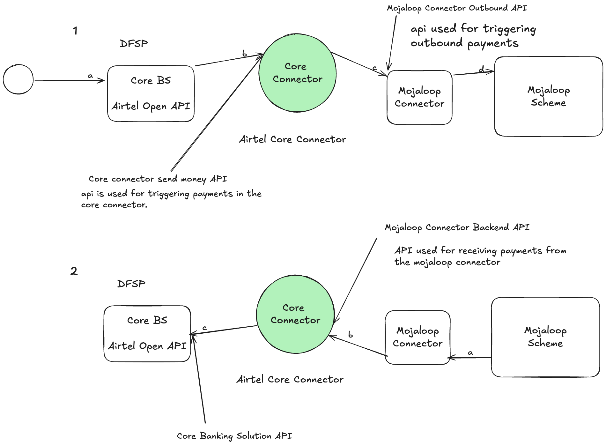

# Core Connector Template
This is a template that can be adapted as a starting point to develop DFSP
core connectors for Payment Manager For Mojaloop

> For full forms check the glossary section

# Introduction
A core connector is a middleware that facilitates a connection between the DFSP and the mojaloop connector.



# Prerequisites
Before you start building a core connector, there are some requirements that need to be in place before implementation starts. These are important because they affect the success of the integration

- CBS Sandbox API
- Access credentials 
- Typescript knowledge
- Beginner docker knowledge 
- Git knowledge
- Mojaloop Knowledge
- For Windows users you will need WSL (Ubuntu)

If you need to get knowledge on how Mojaloop works, consider taking the [Mojaloop Training Program](https://mojaloop.io/mojaloop-training-program/).

# Code structure and Architecture

Below is the directory structure of the core connector template.

To use this template, you will need to understand it's structure, the changing components and the static components which you should not worry about.

```bash
.
├── .circleci
│   └── config.yml
├── .env
├── .env.example
├── .eslintrc.js
├── .gitignore
├── .husky
│   ├── _
│   ├── commit-msg
│   ├── pre-commit
│   └── pre-push
├── .ncurc.json
├── .nvmrc
├── .prettierrc.js
├── Dockerfile
├── LICENSE
├── README.md
├── commitlint.config.js
├── docker-compose.yml
├── jest.config.js
├── package-lock.json
├── package.json
├── src
│   ├── api-spec
│   ├── config.ts
│   ├── constants.ts
│   ├── core-connector-svc
│   ├── domain
│   ├── index.ts
│   ├── infra
│   └── plugins
├── test
│   ├── fixtures.ts
│   ├── func
│   ├── int
│   ├── setup.ts
│   └── unit
└── tsconfig.json

17 directories, 32 files
```
When building integrations for DFSPs the two integrations the core connector should support are payee transactions and payer transactions. i.e receiving incoming payments and initiating outgoing payments

# Payee Integration.

This section describes how to implement payee integrations to support payee operations from the Mojaloop Connector

# How to implement Get Parties
TBD...

# How to implement Quote Requests
TBD...

# How to implenent Transfers
TBD...

# Payer Integration
This section describes how to implement payer integrations to support payer operations to the Mojaloop Connector

# How to implement Send Money
TBD...

# How to implement Update Send Money
TBD...

# Glossary
- DFSP : Digital Financial Service Provider
- CBS: Core Banking Solution
- API: Application Programming Interface
- WSL: Windows Sub-System For Linux