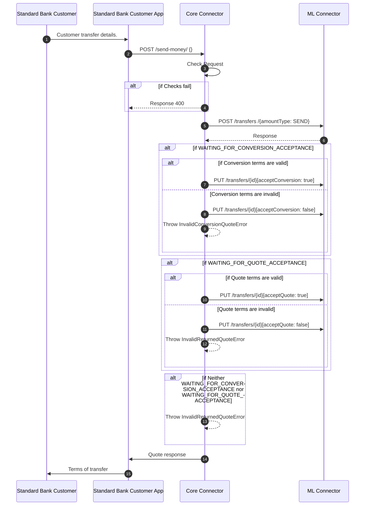

```mermaid
  sequenceDiagram
  autoNumber

  Standard Bank Customer->>Standard Bank Customer App: Customer transfer details.

  Standard Bank Customer App->>Core Connector:POST /send-money/ {}

  Core Connector->>Core Connector: Check Request

  Alt if Checks fail
    Core Connector-->>Standard Bank Customer App: Response 400
  End

  Core Connector->>ML Connector: POST /transfers /{amountType: SEND} 

  ML Connector-->>Core Connector: Response

  Alt if WAITING_FOR_CONVERSION_ACCEPTANCE
    Alt if Conversion terms are valid
      Core Connector->>ML Connector: PUT /transfers/{id}[acceptConversion: true]
    Else Conversion terms are invalid
      Core Connector->>ML Connector: PUT /transfers/{id}[acceptConversion: false]

      Core Connector-->>Core Connector: Throw InvalidConversionQuoteError
    End
  End

  Alt if WAITING_FOR_QUOTE_ACCEPTANCE
    Alt if Quote terms are valid
      Core Connector->>ML Connector: PUT /transfers/{id}[acceptQuote: true]
    Else Quote terms are invalid
      Core Connector->>ML Connector: PUT /transfers/{id}[acceptQuote: false]
      
      Core Connector-->>Core Connector: Throw InvalidReturnedQuoteError
    End
  End


  ALt if Neither WAITING_FOR_CONVERSION_ACCEPTANCE nor WAITING_FOR_QUOTE_ACCEPTANCE
    Core Connector-->>Core Connector: Throw InvalidReturnedQuoteError
  End 


Core Connector->>Standard Bank Customer App: Quote response

Standard Bank Customer App->>Standard Bank Customer: Terms of transfer
```