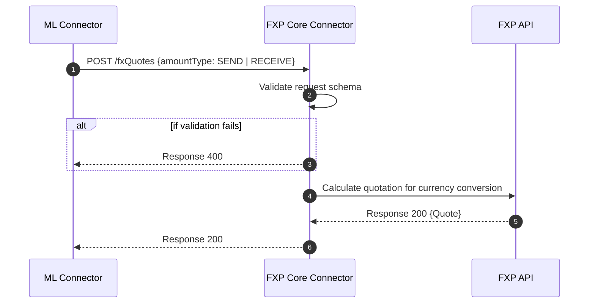

##  FXP fxQuotes Process

This sequence diagram shows the sequence of steps that happen between the mojaloop connector and the fxp core connector to handle fxQuotes.

Quoting for transfers will be for 2 use cases
- P2P Send Money 
- P2B Merchant Payment 

### Send Money Quoting 
Sequence of steps taken while executing an fxQuote request for a P2P transfer

