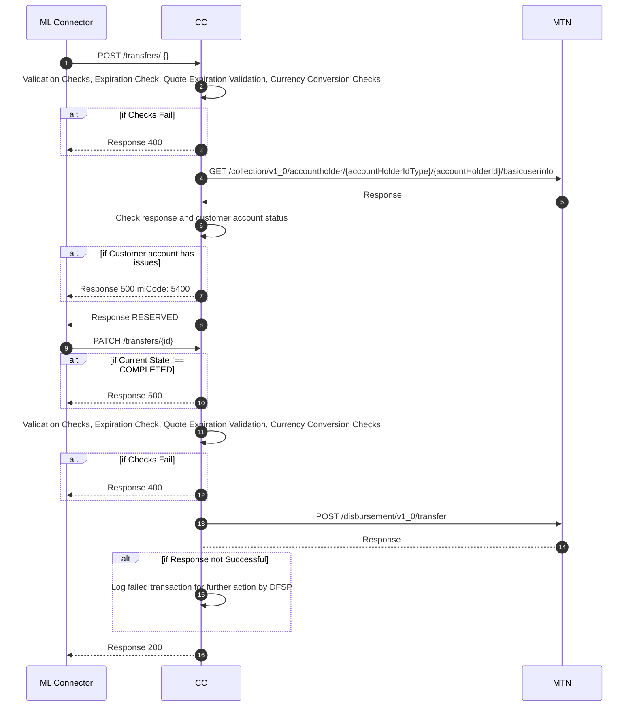

# MTN Payee Receive Transfer
This sequence diagram shows the requests involved in a typical transfer execution phase from the mojaloop connector to the DFSP core connector. This stage involves the mojaloop connector sending a request to credit a beneficiary's account with the funds specified in a POST /transfers request. After the POST /transfers request, if the request is successfully handled, the final result should be a funds reservation in the CBS Api. After a reserved response is sent back to the Mojaloop Connector, the Mojaloop Connector will eventually send back a patch notification that then actually credits funds to the intended beneficiary's account. There are 3 actors involved in the process i.e
- ML Connector, the mojaloop connection middleware
- CC, the core connector that interfaces the mojaloop connector to the core banking apis
- CBS Api, the core banking solution api of the DFSP being connected.

At every request step there are some checks performed by the core connector to ensure the transaction is successful.

# Description
The process begins when the mojaloop connector sends a POST /transfer request to the core connector at `1`. The core connector performs some checks and reserves funds for the transfer. If the funds reservation request is successful, the response is sent back to the mojaloop connector stating the funds have been reserved. Subsequently a PUT notification will be sent by the Mojaloop connector to the Core connector informing it about the status of the transaction. If the status is COMPLETED, the funds can then be committed into the beneficiary's account.

