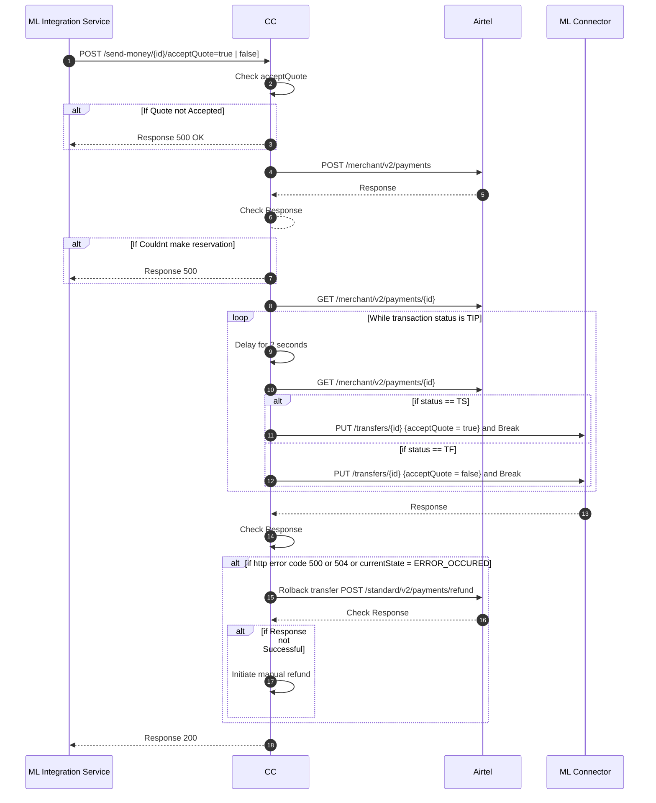

# MTN Payer Update Send Money

```mermaid
sequenceDiagram
  autoNumber
  ML Integration Service->>CC: POST /send-money/{id}/acceptQuote=true | false]
  CC->>CC: Check acceptQuote
  Alt If Quote not Accepted
  CC-->>ML Integration Service: Response 500 OK
  End
  CC->>Airtel:POST /merchant/v2/payments
  Airtel-->>CC:Response
  CC-->CC: Check Response
  Alt If Couldnt make reservation
  CC-->>ML Integration Service: Response 500
  End
  CC->>Airtel: GET  /merchant/v2/payments/{id}
  Loop While transaction status is TIP
  CC->>CC: Delay for 2 seconds
  CC->>Airtel: GET  /merchant/v2/payments/{id}
  Alt if status == TS
  CC->>ML Connector:PUT  /transfers/{id} {acceptQuote = true} and Break
  else if status == TF
  CC->>ML Connector:PUT  /transfers/{id} {acceptQuote = false} and Break
  End
  End
  ML Connector -->> CC: Response
  CC->>CC: Check Response
  Alt if http error code 500 or 504 or currentState = ERROR_OCCURED
  CC->>Airtel : Rolback transfer POST /standard/v2/payments/refund
  Airtel-->>CC:Check Response
  Alt if Response not Successful
  CC->>CC: Initiate manual refund
  End
  End
  CC-->>ML Integration Service: Response 200
```
