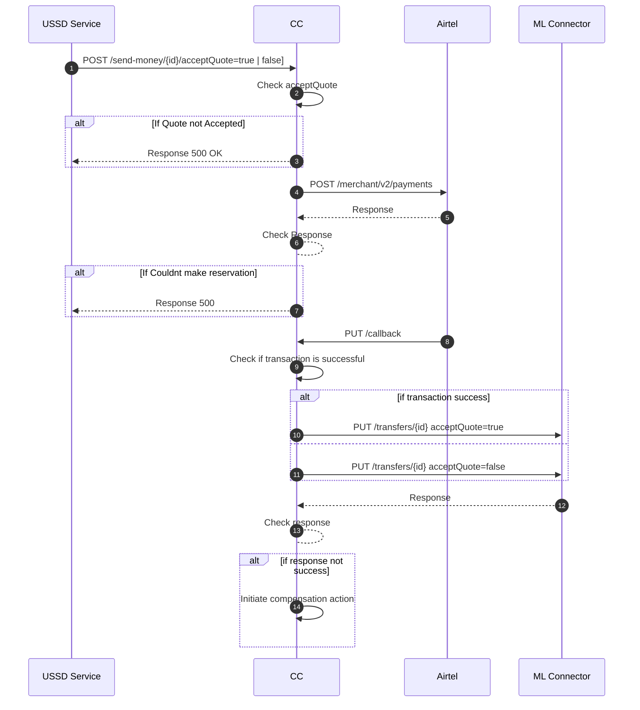

# MTN Payer Update Send Money

This sequence diagram shows the requests involved when a DFSP customer is initiating a payment request into the mojaloop scheme through a mobile, web or USSD application. The components involved in this design are the following

- USSD Service - This is the customer facing application that is used to interact with payment services of the DFSP.
- CC - This is an integration middleware that is used to connect the DFSP to the mojaloop connector.
- ML Connector - This is a software that facilitates connection into the mojaloop switch.
- CBS Api, the core banking solution api of the DFSP being connected.

# Description
This process begins when beneficiary information has been returned back to the customer application and shown to the user. Once the user confirms the details of the beneficiary, They will then click continue to proceed with the transfer. Their account will be debited and a message sent to Mojaloop to commit the transfer using a PUT request.

