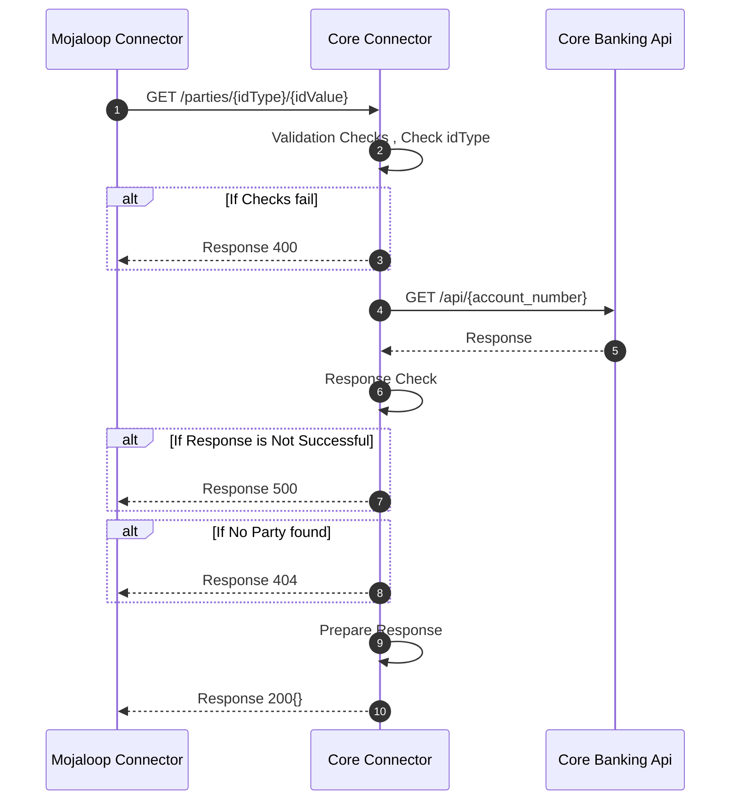

# Payee Get Parties 

This sequence diagram shows the requests involved in a typical discovery call from the mojaloop connector the DFSP core connector.  There are 3 actors involved in the process i.e
- Mojaloop Connector, the mojaloop connection middleware
- Core Connector, the core connector that interfaces the mojaloop connector to the core banking apis
-  Core Banking Api, the core banking solution api of the DFSP being connected.

At every request step there are some checks performed by the core connector to ensure the transaction is successful.

# Description
The process startes when the Mojaloop Connector sends an account lookup request to the core connector at stage `1`. The core connector checks the request parameters to see if they are valid are consistent with allowed values and data types. If the checks fail, at stage `3`, and error response is sent back to the Mojaloop Connector. The core connector at stage `4` then makes a request to the Core Banking Api to make an account discovery call to make sure find out KYC data about the owner of the received account identifier value. The Core Banking Api returns a response, some checks are performed and the party information is returned at stage `10` back to the Mojaloop Connnector 

