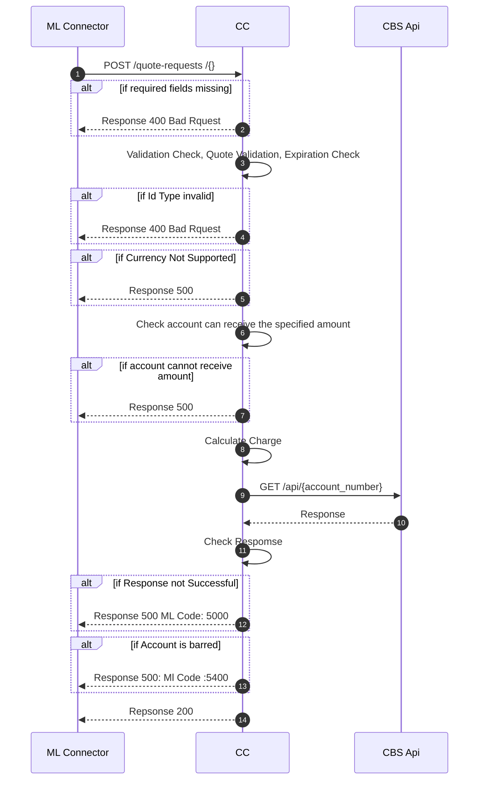

# Payee Quote requests for this DFSP

This sequence diagram shows the requests involved in a typical transfer agreement phase from the mojaloop connector to the DFSP core connector. This stage involves the mojaloop connector inquiring from the DFSP how much it will cost to perform a particular transaction. There are 3 actors involved in the process i.e
- ML Connector, the mojaloop connection middleware
- CC, the core connector that interfaces the mojaloop connector to the core banking apis
- CBS Api, the core banking solution api of the DFSP being connected.

At every request step there are some checks performed by the core connector to ensure the transaction is successful.

# Description
The process starts when the Mojaloop Connector sends a request to the Core connector to calcuate the cost of a transaction at stage `1`. Some checks are performed to validate the request data and parameters and check whether the specified amount can actually be credited on the destination beneficiary. A service charge is calculated by the core connector and KYC information is requested to confirm the user account is not blocked. If all passes well, a response is sent containing the fees that will be associated with the transfer.

