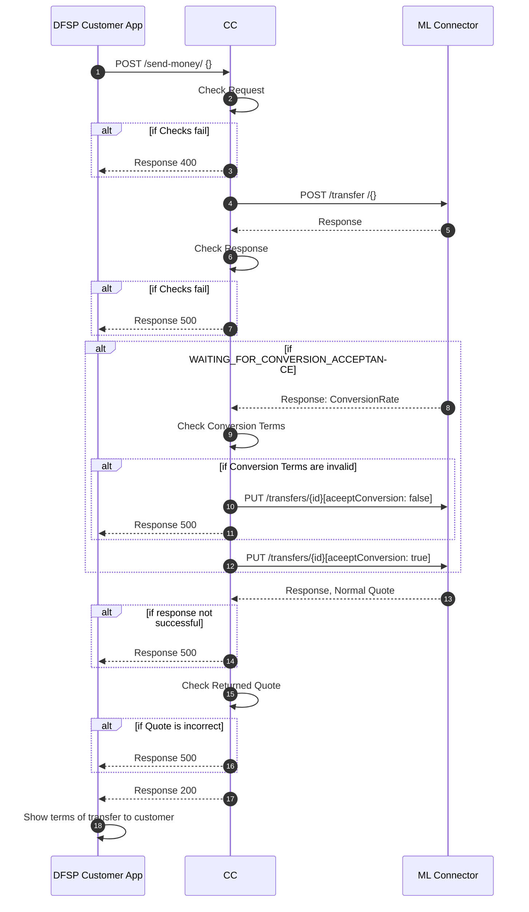

# Payer Send Money

This sequence diagram shows the requests involved when a DFSP customer is initiating a payment request into the mojaloop scheme through a mobile, web or USSD application. The components involved in this design are the following

- DFSP Customer App - This is the customer facing application that is used to interact with payment services of the DFSP.
- CC - This is an integration middleware that is used to connect the DFSP to the mojaloop connector.
- ML Connector - This is a software that facilitates connection into the mojaloop switch.

# Description
The process begins when a customer of the DFSP initiates a send money action through the COMESA Digital Retail Payments Platform. The user would usually specify the amount, account of the destination beneficiary and country to which the funds are going. After that they will click send. What this does in the background is send a POST /send-money request to the Core connector. The core connector will perform some checks on the request payload and then it will send a payment initiation request to the Mojaloop Switch through the mojaloop connector. The connector will then respond with payee information like the name and fees of the transaction.

