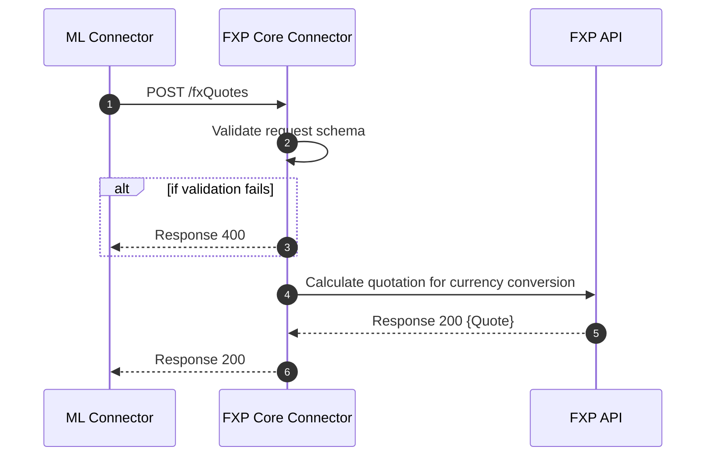

##  FXP fxQuotes Process

This sequence diagram shows the sequence of steps that happen between the mojaloop connector and the fxp core connector to handle fxQuotes.

```mermaid
sequenceDiagram
    autonumber
    ML Connector ->> FXP Core Connector: POST /fxQuotes
    FXP Core Connector ->> FXP Core Connector: Validate request schema
    Alt if validation fails
    FXP Core Connector -->> ML Connector: Response 400
    End
    FXP Core Connector ->> FXP API: Calculate quotation for currency conversion
    FXP API -->> FXP Core Connector: Response 200 {Quote}
    FXP Core Connector -->> ML Connector: Response 200
```