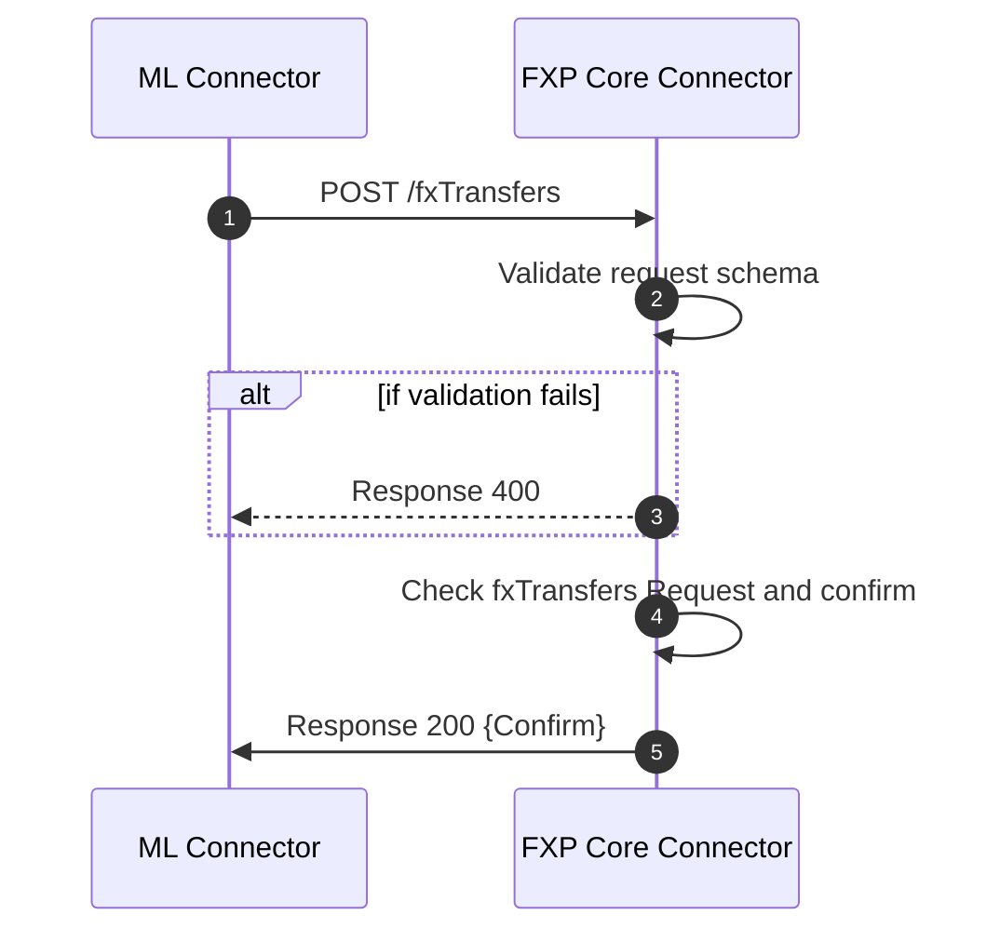

## FXP fxTransfers Process

This sequence diagram shows the sequence of steps that happen between the mojaloop connector and FXP Core Connector when performing an fxTransfers request

```mermaid
sequenceDiagram
    autonumber
    ML Connector ->> FXP Core Connector: POST /fxTransfers
    FXP Core Connector ->> FXP Core Connector: Validate request schema
    Alt if validation fails
    FXP Core Connector -->> ML Connector: Response 400
    End
    FXP Core Connector ->> FXP Core Connector: Check fxTransfers Request and confirm
    FXP Core Connector ->> ML Connector:  Response 200 {Confirm}
```