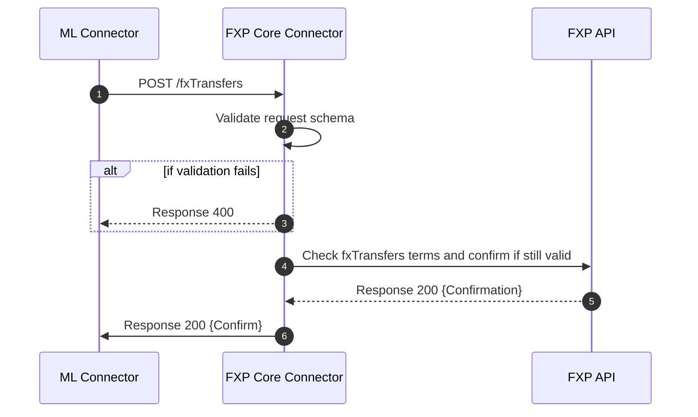
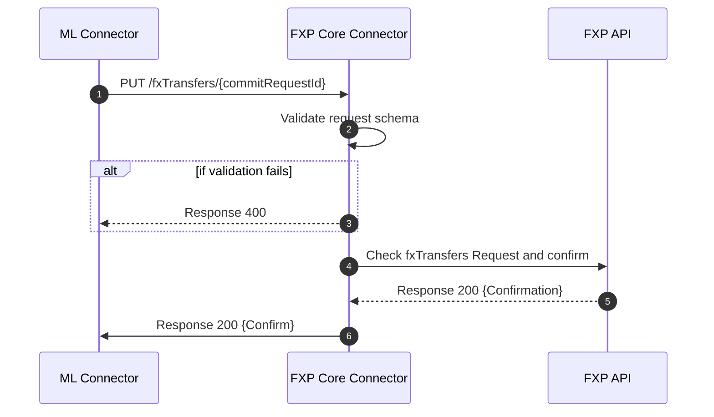

## FXP fxTransfers Process

This sequence diagram shows the sequence of steps that happen between the mojaloop connector and FXP Core Connector when performing an fxTransfers request

### POST /fxTransfers 
Process used to check if the conversion terms that were quoted earlier are still valid to execute a transfer.

### PUT /fxTransfers/{commitRequestId}
Process used to notify the FXP backend about the terminal state of an fxTransfer. Either as `COMPLETED` or `ERROR_OCCURED`

