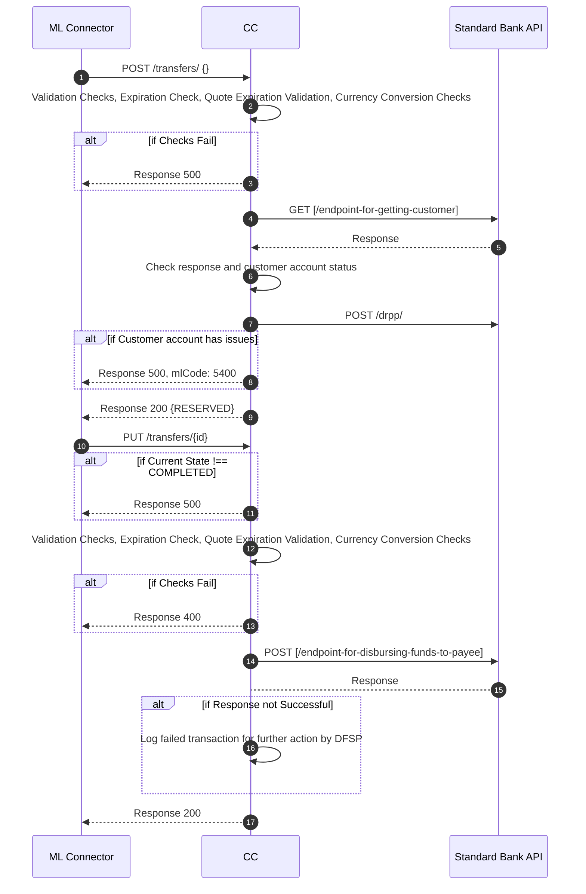

```mermaid

sequenceDiagram
  autoNumber

ML Connector ->> CC:  POST /transfers/ {}

CC->>CC:Validation Checks, Expiration Check, Quote Expiration Validation, Currency Conversion Checks

Alt if Checks Fail
  CC-->>ML Connector: Response 500
End

CC->>Standard Bank API: GET [/endpoint-for-getting-customer] 

Standard Bank API-->>CC: Response 

CC->>CC: Check response and customer account status 

CC->>Standard Bank API: POST /drpp/ 

Alt if Customer account has issues 
  CC-->> ML Connector: Response 500, mlCode: 5400
End

CC-->>ML Connector: Response 200 {RESERVED}

ML Connector->>CC: PUT /transfers/{id}

Alt if Current State !== COMPLETED
  CC-->>ML Connector: Response 500
End

CC->>CC: Validation Checks, Expiration Check, Quote Expiration Validation, Currency Conversion Checks

Alt if Checks Fail
  CC-->>ML Connector: Response 400
End

CC->>Standard Bank API: POST [/endpoint-for-disbursing-funds-to-payee]

Standard Bank API-->CC: Response

Alt if Response not Successful
  CC->>CC: Log failed transaction for further action by DFSP
End

CC-->>ML Connector: Response 200
```