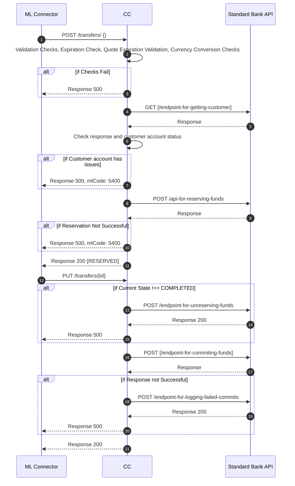

```mermaid

sequenceDiagram
  autoNumber

ML Connector ->> CC:  POST /transfers/ {}

CC->>CC:Validation Checks, Expiration Check, Quote Expiration Validation, Currency Conversion Checks

Alt if Checks Fail
  CC-->>ML Connector: Response 500
End

CC->>Standard Bank API: GET [/endpoint-for-getting-customer] 

Standard Bank API-->>CC: Response 

CC->>CC: Check response and customer account status 
Alt if Customer account has issues 
  CC-->> ML Connector: Response 500, mlCode: 5400
End

CC->>Standard Bank API: POST /api-for-reserving-funds 
Standard Bank API-->>CC: Response


Alt if Reservation Not Successful
  CC-->> ML Connector: Response 500, mlCode: 5400
End

CC-->> ML Connector: Response 200 [RESERVED]


ML Connector->>CC: PUT /transfers/{id}

Alt if Current State !== COMPLETED
  CC->>Standard Bank API: POST /endpoint-for-unreserving-funds
  Standard Bank API-->>CC: Response 200
  %% CC->>CC: Log Reponse
  CC-->>ML Connector: Response 500
End


CC->>Standard Bank API: POST [/endpoint-for-commiting-funds]

Standard Bank API-->>CC: Response

Alt if Response not Successful
  CC->>Standard Bank API: POST /endpoint-for-logging-failed-commits
  Standard Bank API-->>CC: Response 200
  CC-->>ML Connector: Response 500
End


CC-->>ML Connector: Response 200
```