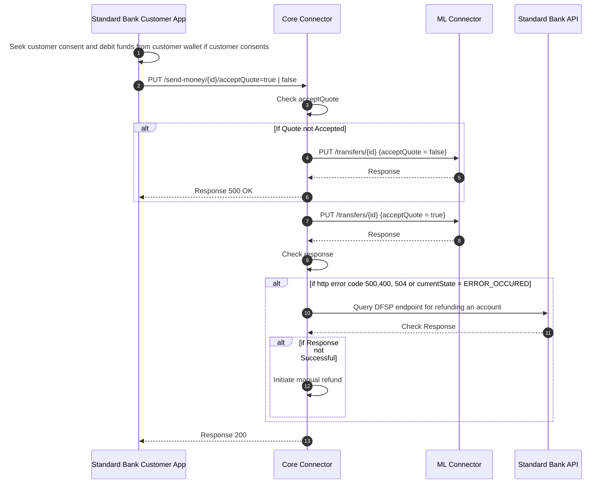

```mermaid
  sequenceDiagram

  autoNumber

  Standard Bank Customer App->>Standard Bank Customer App: Seek customer consent and debit funds from customer wallet if customer consents

  Standard Bank Customer App->>Core Connector: PUT /send-money/{id}/acceptQuote=true | false

  Core Connector->>Core Connector: Check acceptQuote

  Alt If Quote not Accepted
    Core Connector->>ML Connector:PUT  /transfers/{id} {acceptQuote = false}

    ML Connector-->>Core Connector: Response 
    
    Core Connector-->>Standard Bank Customer App: Response 500 OK
  End 

  Core Connector->>ML Connector:PUT  /transfers/{id} {acceptQuote = true}
  
  ML Connector-->>Core Connector: Response
  
  Core Connector->>Core Connector: Check response
  
  Alt if http error code 500,400, 504 or currentState = ERROR_OCCURED
    Core Connector->>Standard Bank API : Query DFSP endpoint for refunding an account
    
    Standard Bank API-->>Core Connector:Check Response
    
    Alt if Response not Successful
      Core Connector->>Core Connector: Initiate manual refund
    End
  End
  
 Core Connector-->>Standard Bank Customer App: Response 200
 
```