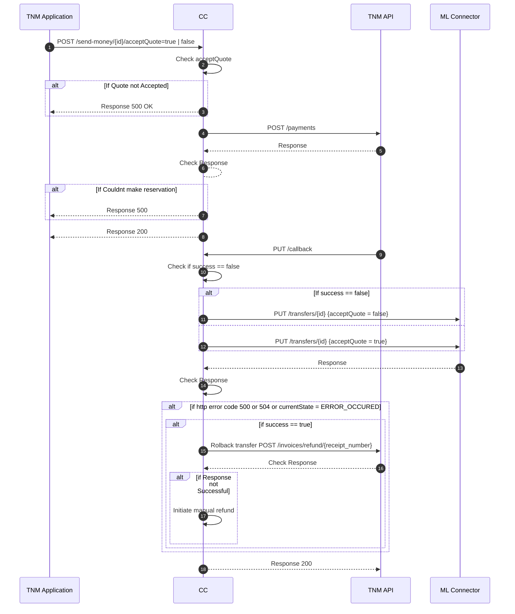

```mermaid
sequenceDiagram
  autoNumber
  TNM Application->>CC: POST /send-money/{id}/acceptQuote=true | false
  CC->>CC: Check acceptQuote
  Alt If Quote not Accepted
  CC-->>TNM Application: Response 500 OK
  End
  CC->>TNM API:POST /payments
  TNM API-->>CC:Response
  CC-->CC: Check Response
  Alt If Couldnt make reservation
  CC-->>TNM Application: Response 500
  End
  CC-->>TNM Application: Response 200
  TNM API->>CC: PUT /callback
  CC->>CC: Check if success == false
  Alt If success == false
  CC->>ML Connector:PUT  /transfers/{id} {acceptQuote = false}
  Else
  CC->>ML Connector:PUT  /transfers/{id} {acceptQuote = true}
  End
  ML Connector -->> CC: Response
  CC->>CC: Check Response
  Alt if http error code 500 or 504 or currentState = ERROR_OCCURED
  Alt if success == true
  CC->>TNM API : Rolback transfer POST /invoices/refund/{receipt_number}
  TNM API-->>CC:Check Response
  Alt if Response not Successful
  CC->>CC: Initiate manual refund
  End
  End
  End
   CC-->>TNM API: Response 200

```
