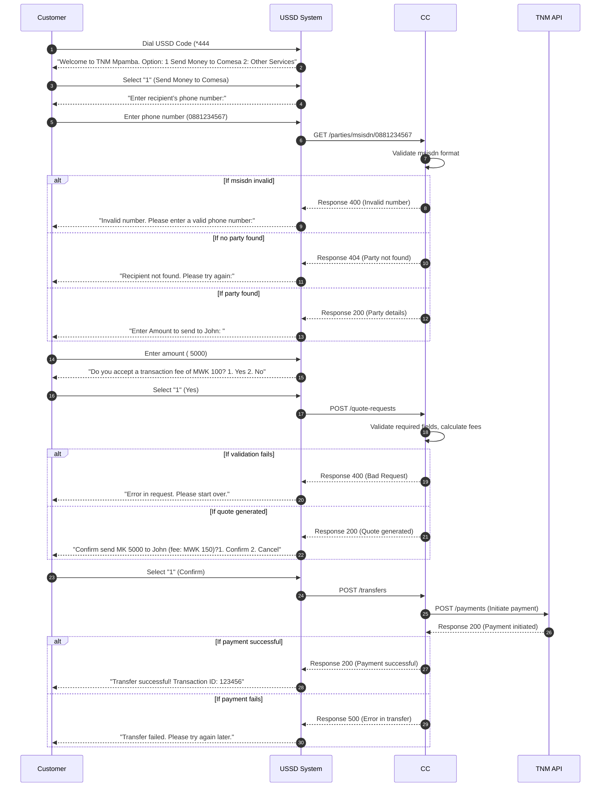

```mermaid
sequenceDiagram
  autonumber
  Customer->>USSD System: Dial USSD Code (*444#)
  USSD System-->>Customer: "Welcome to TNM Mpamba. Option: 1 Send Money to Comesa 2: Other Services"
  Customer->>USSD System: Select "1" (Send Money to Comesa)
  
  USSD System-->>Customer: "Enter recipient’s phone number:"
  Customer->>USSD System: Enter phone number (0881234567)
  
  USSD System->>CC: GET /parties/msisdn/0881234567
  CC->>CC: Validate msisdn format
  Alt If msisdn invalid
    CC-->>USSD System: Response 400 (Invalid number)
    USSD System-->>Customer: "Invalid number. Please enter a valid phone number:"
  Else If no party found
    CC-->>USSD System: Response 404 (Party not found)
    USSD System-->>Customer: "Recipient not found. Please try again:"
  Else If party found
    CC-->>USSD System: Response 200 (Party details)
    USSD System-->>Customer: "Enter Amount to send to John: "
  End
  
  Customer->>USSD System: Enter amount ( 5000)
  
  USSD System-->>Customer: "Do you accept a transaction fee of MWK 100? 1. Yes 2. No"
  Customer->>USSD System: Select "1" (Yes)
  
  USSD System->>CC: POST /quote-requests
  CC->>CC: Validate required fields, calculate fees
  Alt If validation fails
    CC-->>USSD System: Response 400 (Bad Request)
    USSD System-->>Customer: "Error in request. Please start over."
  Else If quote generated
    CC-->>USSD System: Response 200 (Quote generated)
    USSD System-->>Customer: "Confirm send MK 5000 to John (fee: MWK 150)?1. Confirm 2. Cancel"
  End
  
  Customer->>USSD System: Select "1" (Confirm)
  
  USSD System->>CC: POST /transfers
  CC->>TNM API: POST /payments (Initiate payment)
  TNM API-->>CC: Response 200 (Payment initiated)
  
  Alt If payment successful
    CC-->>USSD System: Response 200 (Payment successful)
    USSD System-->>Customer: "Transfer successful! Transaction ID: 123456"
  Else If payment fails
    CC-->>USSD System: Response 500 (Error in transfer)
    USSD System-->>Customer: "Transfer failed. Please try again later."
  End
```