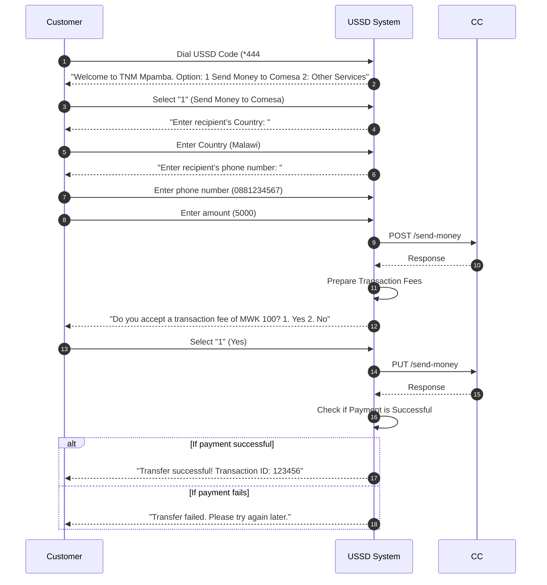

```mermaid
sequenceDiagram
  autonumber
  Customer->>USSD System: Dial USSD Code (*444#)
  USSD System-->>Customer: "Welcome to TNM Mpamba. Option: 1 Send Money to Comesa 2: Other Services"
  Customer->>USSD System: Select "1" (Send Money to Comesa)
  
  USSD System-->>Customer: "Enter recipient’s Country: "
  Customer->>USSD System: Enter Country (Malawi)
  USSD System-->>Customer: "Enter recipient’s phone number: "
  Customer->>USSD System: Enter phone number (0881234567)
  

  
  Customer->>USSD System: Enter amount (5000)
  USSD System->>CC: POST /send-money
  CC-->>USSD System: Response
  USSD System->>USSD System: Prepare Transaction Fees
  USSD System-->>Customer: "Do you accept a transaction fee of MWK 100? 1. Yes 2. No"
  Customer->>USSD System: Select "1" (Yes)
  
  USSD System->>CC: PUT /send-money
  CC-->>USSD System: Response
  USSD System->>USSD System: Check if Payment is Successful
  
  Alt If payment successful

    USSD System-->>Customer: "Transfer successful! Transaction ID: 123456"
  Else If payment fails
    
    USSD System-->>Customer: "Transfer failed. Please try again later."
  End
```