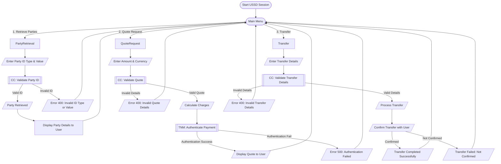

```mermaid
flowchart TD
  Start([Start USSD Session])
  
  Menu1([Main Menu]) --> |"1. Retrieve Parties"| PartyRetrieval
  Menu1 --> |"2. Quote Request"| QuoteRequest
  Menu1 --> |"3. Transfer"| Transfer

  Start --> Menu1
  
  PartyRetrieval --> PartyInput[/"Enter Party ID Type & Value"/]
  PartyInput --> ValidateParty[[CC: Validate Party ID]]
  ValidateParty --> |"Valid ID"| PartyRetrieved[/"Party Retrieved"/]
  ValidateParty --> |"Invalid ID"| Error400[/"Error 400: Invalid ID Type or Value"/]
  PartyRetrieved --> MainResponse1["Display Party Details to User"]

  QuoteRequest --> QuoteInput[/"Enter Amount & Currency"/]
  QuoteInput --> ValidateQuote[[CC: Validate Quote]]
  ValidateQuote --> |"Valid Quote"| CalcCharge[/"Calculate Charges"/]
  ValidateQuote --> |"Invalid Details"| ErrorQuote400[/"Error 400: Invalid Quote Details"/]
  CalcCharge --> Authenticate[[TNM: Authenticate Payment]]
  Authenticate --> |"Authentication Success"| DisplayQuote[/"Display Quote to User"/]
  Authenticate --> |"Authentication Fail"| ErrorQuote500[/"Error 500: Authentication Failed"/]

  Transfer --> TransferInput[/"Enter Transfer Details"/]
  TransferInput --> ValidateTransfer[[CC: Validate Transfer Details]]
  ValidateTransfer --> |"Valid Details"| ProcessTransfer[/"Process Transfer"/]
  ValidateTransfer --> |"Invalid Details"| ErrorTransfer400[/"Error 400: Invalid Transfer Details"/]
  ProcessTransfer --> ConfirmTransfer[/"Confirm Transfer with User"/]
  ConfirmTransfer --> |"Confirmed"| CompleteTransfer[/"Transfer Completed Successfully"/]
  ConfirmTransfer --> |"Not Confirmed"| ErrorTransfer500[/"Transfer Failed: Not Confirmed"/]

  Error400 --> Menu1
  ErrorQuote400 --> Menu1
  ErrorQuote500 --> Menu1
  ErrorTransfer400 --> Menu1
  ErrorTransfer500 --> Menu1
  CompleteTransfer --> Menu1
  MainResponse1 --> Menu1
  DisplayQuote --> Menu1
```