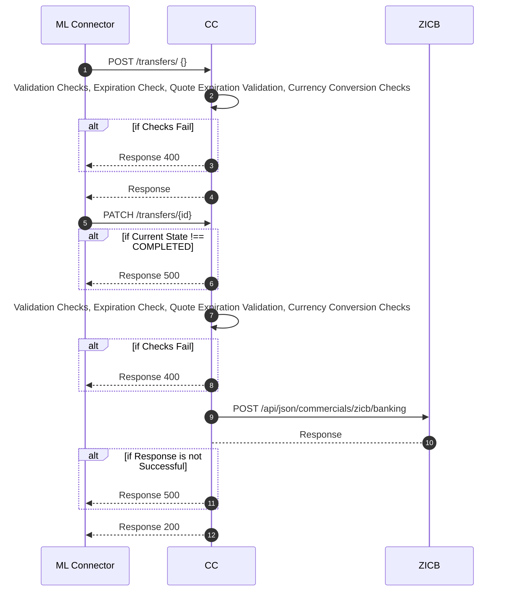

```mermaid
sequenceDiagram
  autoNumber
  ML Connector ->> CC:  POST /transfers/ {}
  CC->>CC:Validation Checks, Expiration Check, Quote Expiration Validation, Currency Conversion Checks
  Alt if Checks Fail
  CC-->>ML Connector: Response 400
  End
  CC-->>ML Connector: Response
  ML Connector->>CC: PATCH /transfers/{id}
  Alt if Current State !== COMPLETED
  CC-->>ML Connector: Response 500
  End
  CC->>CC: Validation Checks, Expiration Check, Quote Expiration Validation, Currency Conversion Checks
  Alt if Checks Fail
  CC-->>ML Connector: Response 400
  End
  CC->>ZICB: POST /api/json/commercials/zicb/banking
  ZICB-->CC: Response
  ALt if Response is not Successful
  CC-->>ML Connector: Response 500
  End
  CC-->>ML Connector: Response 200

```
