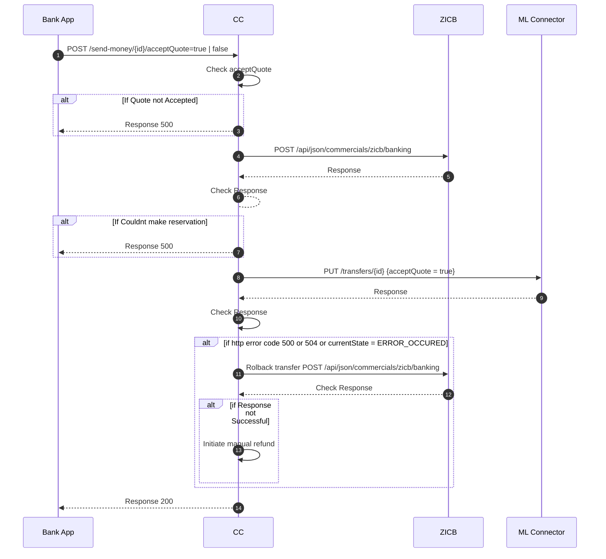

```mermaid
sequenceDiagram
  autoNumber
  Bank App->>CC: POST /send-money/{id}/acceptQuote=true | false
  CC->>CC: Check acceptQuote
  Alt If Quote not Accepted
  CC-->>Bank App: Response 500
  End
  CC->>ZICB: POST /api/json/commercials/zicb/banking
  ZICB-->>CC: Response
  CC-->CC: Check Response
  Alt If Couldnt make reservation
  CC-->>Bank App: Response 500
  End
  CC->>ML Connector: PUT  /transfers/{id} {acceptQuote = true}

  ML Connector -->> CC: Response
  CC->>CC: Check Response
  Alt if http error code 500 or 504 or currentState = ERROR_OCCURED
  CC->>ZICB : Rolback transfer POST /api/json/commercials/zicb/banking
  ZICB-->>CC:Check Response
  Alt if Response not Successful
  CC->>CC: Initiate manual refund
  End
  End
  CC-->>Bank App: Response 200
```
