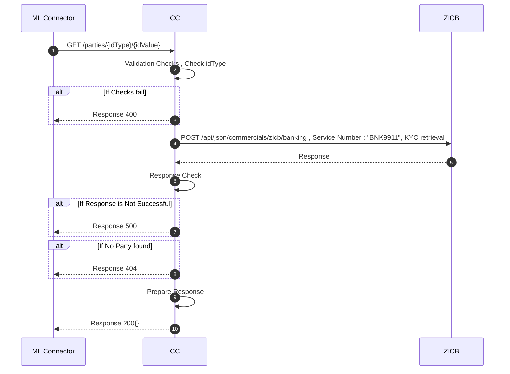

# Payee Get Parties 
This sequence diagram shows the series of steps taken to perform an account lookup operation when a request is initiated by the SDK scheme adapter to the core connector.

```mermaid
sequenceDiagram
  autonumber
  ML Connector->>CC: GET /parties/{idType}/{idValue}
  CC->>CC:Validation Checks , Check idType
  Alt If Checks fail
  CC-->>ML Connector: Response 400
  End
  CC->>ZICB: POST /api/json/commercials/zicb/banking , Service Number : "BNK9911", KYC retrieval
  ZICB-->>CC: Response
  CC->>CC:Response Check
  Alt If Response is Not Successful
  CC-->>ML Connector: Response 500
  End
  Alt If No Party found
  CC-->>ML Connector: Response 404
  End
  CC->>CC: Prepare Response
  CC-->>ML Connector: Response 200{}
```
