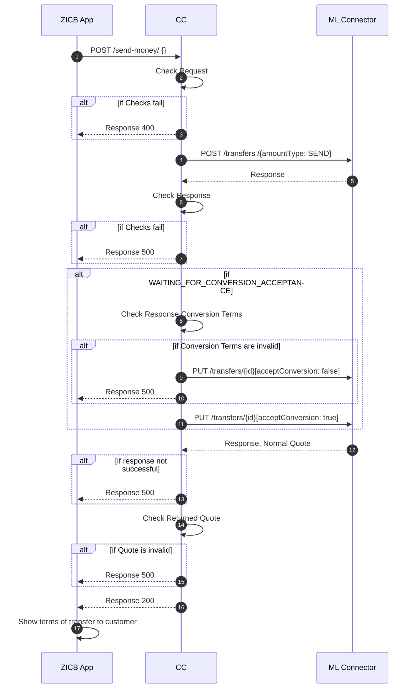

# Payer Send Money
This sequence diagram shows the series of steps the core connector takes to handle a POST `/send-money` request from the ZICB Application. 

```mermaid
sequenceDiagram
  autoNumber
  ZICB App->>CC: POST /send-money/ {}
  CC->>CC: Check Request
  Alt if Checks fail
  CC-->>ZICB App: Response 400
  End
  CC->>ML Connector: POST /transfers /{amountType: SEND} 
  ML Connector-->>CC: Response
  CC->> CC: Check Response
  Alt if Checks fail
  CC-->>ZICB App: Response 500
  End

  Alt if WAITING_FOR_CONVERSION_ACCEPTANCE
  CC->>CC: Check Response Conversion Terms
  Alt if Conversion Terms are invalid
  CC->>ML Connector: PUT /transfers/{id}[acceptConversion: false]
  CC-->>ZICB App: Response 500
  End
  CC->>ML Connector: PUT /transfers/{id}[acceptConversion: true]
  End
  ML Connector-->>CC:Response, Normal Quote
  Alt if response not successful
  CC-->>ZICB App: Response 500
  End
  CC->>CC: Check Returned Quote
  Alt if Quote is invalid
  CC-->>ZICB App: Response 500
  End
  CC-->>ZICB App: Response 200
  ZICB App->>ZICB App:Show terms of transfer to customer
```
